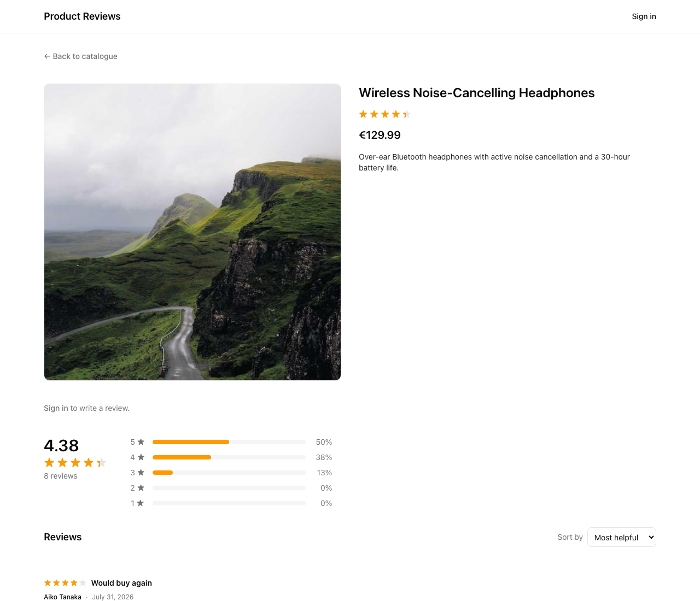
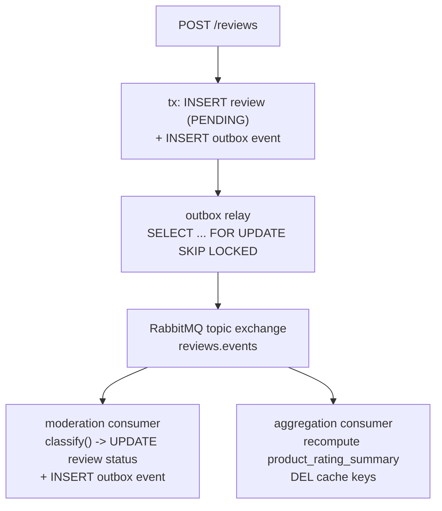

# Product Reviews Platform

## What this is

A product reviews platform in the spirit of Amazon or Alza: shoppers browse a
catalogue, read and write reviews, and vote on helpfulness. Every submission
passes through automatic and manual moderation before it counts toward a
product's rating.



## Quick start

```bash
git clone <this-repository-url>
cd product-reviews-platform
docker compose up -d --wait
```

Open **http://localhost:3000**. `docker compose up` builds all three
application images, starts Postgres, Redis, and RabbitMQ, runs migrations
and seeds the database as a one-shot job, then starts the API, the worker,
and the web app — nothing else needs to run first.

There is deliberately no `cp .env.example .env` step here. `docker-compose.yml`
carries every value it needs literally, with no variable interpolation, so a
`.env` file would be read by nothing on this path — copying one would only
create the impression that editing it changes something. `.env` matters for
the host-based workflow under [Development](#development) below.

| Email | Password | Role |
|---|---|---|
| `alice@example.com` | `password123` | Customer |
| `bob@example.com` | `password123` | Customer |
| `mod@example.com` | `password123` | Moderator |

(The login page also offers a one-click picker for these accounts; see
`packages/db/prisma/seed.ts` for the full cast, including ten more
customer accounts used to give products a believable spread of reviewers.)

| What | URL |
|---|---|
| Web app | http://localhost:3000 |
| API | http://localhost:3001/api/v1 |
| API docs (OpenAPI/Swagger) | http://localhost:3001/docs |
| RabbitMQ management UI | http://localhost:15672 (`guest` / `guest`) |

## How it works

Three processes share Postgres, Redis, and RabbitMQ. The API is the only
writer and never publishes to the broker directly — it writes an event to an
outbox table in the same transaction as the state change, and a relay in the
worker process is what actually publishes:



- **`apps/api`** — NestJS HTTP service. Owns every write and the outbox.
- **`apps/worker`** — NestJS standalone process. Runs the outbox relay and
  the moderation and rating-aggregation consumers.
- **`apps/web`** — Next.js (App Router) frontend.

The design document (`docs/design/2026-09-13-product-reviews-design.md`) is
the authoritative source for this system and goes into far more depth than
this README; the ADRs in `docs/adr/` record why the contested parts of it
are shaped the way they are.

## Try the interesting bits

With the stack running from the quick start above:

1. **Submit a clean review and watch it publish fast.** Sign in as
   `alice@example.com` and open the [Smart LED Desk
   Lamp](http://localhost:3000/products/smart-led-desk-lamp) — the seed
   doesn't give her a review there. Submit one. It appears as `PENDING`
   immediately (`202 Accepted`); refresh a moment later and it has moved to
   `APPROVED` and counts toward the rating. Measured directly against the
   outbox table during this task's verification, a clean review went from
   submission to the rating summary being updated in **756ms** — normally
   well under a second, but asynchronous, not instant.
2. **Submit one in capitals and find it in the moderator queue.** Sign in as
   `bob@example.com` and open the [Nonstick Ceramic Cookware
   Set](http://localhost:3000/products/nonstick-ceramic-cookware-set) —
   the seed doesn't give him a review there either. Submit something like
   `"THIS IS TERRIBLE, I WANT A REFUND"`. The automatic classifier flags
   excessive uppercase; the review lands in `FLAGGED`, not `PENDING`, and
   shows up for `mod@example.com` at http://localhost:3000/moderation with
   the reason attached.
3. **Open the RabbitMQ management UI** (http://localhost:15672, `guest` /
   `guest`) and watch the `moderation.review-submitted` and
   `aggregation.review-visibility` queues while you submit reviews — message
   rates tick up and back down to zero as the consumers drain them.
4. **Stop the worker, submit a review, watch it wait, then watch it drain.**
   This is the whole point of the outbox, made visible in about thirty
   seconds:

   ```bash
   docker compose stop worker
   ```

   Submit a review through the UI or the API — `bob@example.com` on the
   [Portable Bluetooth
   Speaker](http://localhost:3000/products/portable-bluetooth-speaker)
   works, and is still free after step 2. One review per person per
   product is enforced by a unique constraint, so if you reuse a pair the
   seed already used you'll get a `409` instead; the pairs suggested in
   these steps are chosen to avoid that. The review stays `PENDING` —
   nothing is consuming the outbox. Confirm the row is sitting there
   unpublished:

   ```bash
   docker compose exec postgres psql -U reviews -d reviews \
     -c "select event_type, occurred_at, published_at, attempts from outbox where published_at is null;"
   ```

   ```
       event_type    |       occurred_at       | published_at | attempts
   ------------------+-------------------------+--------------+----------
    review.submitted | 2026-09-15 03:03:01.034 |              |        0
   (1 row)
   ```

   Now bring the worker back:

   ```bash
   docker compose start worker
   ```

   Re-run the query for that review's events and both now have a
   `published_at` timestamp:

   ```
       event_type    |       occurred_at       |      published_at       | attempts
   ------------------+-------------------------+-------------------------+----------
    review.submitted | 2026-09-15 03:03:01.034 | 2026-09-15 03:03:14.52  |        0
    review.approved  | 2026-09-15 03:03:14.543 | 2026-09-15 03:03:15.017 |        0
   (2 rows)
   ```

   The worker's own log shows the whole drain — submit, moderate, approve —
   finishing within about two seconds of the process starting back up:

   ```
   [Nest] Starting Nest application...                                    3:03:13 AM
   {"msg":"outbox relay: published event ... (review.submitted)"}         3:03:14.524
   {"msg":"processed event ... from queue \"moderation.review-submitted\""} 3:03:14.548
   {"msg":"outbox relay: published event ... (review.approved)"}          3:03:15.022
   {"msg":"processed event ... from queue \"aggregation.review-visibility\""} 3:03:15.038
   ```

   And the review itself, fetched again through the API, now reads
   `"status":"APPROVED"`. Nothing was lost while the worker was down, and
   nothing had to be retried by hand — that's the outbox doing its job.

## Development

Requires Node 22 (pinned in `.nvmrc`) and pnpm.

```bash
pnpm install
pnpm infra:up          # Postgres, Redis, RabbitMQ only — no app containers
cp .env.example .env   # already points at localhost, correct for this mode
pnpm --filter @reviews/db db:migrate
pnpm --filter @reviews/db db:seed
pnpm --filter @reviews/api start:dev     # http://localhost:3001
pnpm --filter @reviews/worker start:dev
pnpm --filter @reviews/web start:dev     # http://localhost:3000
```

`pnpm infra:up` and `pnpm infra:down` (`docker-compose.dev.yml`) start only
the infrastructure, not the application containers — useful for running the
three processes on the host with live reload. Stop the full `docker compose`
stack first if it's running, since both compose files bind the same host
ports.

Tests, at each level:

```bash
pnpm test:unit                              # fast, no infrastructure
pnpm test:integration                       # real Postgres/Redis/RabbitMQ via Testcontainers
pnpm test:e2e                               # Playwright, against a running docker compose stack
```

`pnpm test` runs unit then integration, with integration serialised
(`--concurrency=1`) rather than run in parallel — see "known test
flakiness" below for why.

Migrations and the generated client:

```bash
pnpm --filter @reviews/db db:migrate        # prisma migrate deploy
pnpm --filter @reviews/db run generate      # regenerate the Prisma client after a schema change
```

## Design decisions and trade-offs

Short version of each ADR in `docs/adr/`; read the linked file for the
alternative each one rejected and why.

- **[0001 — Modular monolith over microservices](docs/adr/0001-modular-monolith-over-microservices.md).**
  Three processes, one bounded context, module boundaries drawn so a future
  service extraction is mechanical. Rejected splitting by domain because
  nothing here needs independent scaling or deployment.
- **[0002 — Transactional outbox](docs/adr/0002-transactional-outbox.md).**
  The API writes an event to an outbox table in the same transaction as the
  state change instead of publishing to RabbitMQ directly, so a review and
  its event cannot diverge. It costs a relay process, a table, and
  at-least-once delivery every consumer has to tolerate.
- **[0003 — Recomputed projections over deltas](docs/adr/0003-recomputed-projections.md).**
  The rating summary is recomputed from source on every event rather than
  incremented, so a redelivered event is harmless by construction instead
  of by a deduplication table. The cost is an aggregate scan and a row lock
  per event, acceptable at this traffic and not at very high concurrent
  write rates on one product.
- **[0004 — Identity columns over BIGSERIAL](docs/adr/0004-identity-columns-over-bigserial.md).**
  The outbox's primary key uses `GENERATED ALWAYS AS IDENTITY` rather than
  Prisma's default `BIGSERIAL`, verified empirically to survive
  `prisma migrate dev` without drift.
- **[0005 — Cursor pagination over offset](docs/adr/0005-cursor-pagination.md).**
  Every list endpoint pages by an opaque cursor, not `LIMIT/OFFSET`, for
  correctness under concurrent inserts and flat cost at depth.

**The honest part.** The outbox, the relay, and a message broker are more
machinery than this traffic actually needs — a reviews system at this scale
could update the rating in the same transaction as the review and be done
with it. It's here because the failure it prevents (a lost or phantom event)
is the one that silently corrupts data and is painful to find in production,
and because the event log makes future additions — notifications, search
indexing, analytics — additive instead of invasive. If this were a startup
optimising purely for time to market, I would ship synchronous aggregates
first and introduce the outbox at the point a second consumer of review
events actually showed up, not before.

## What I would do next

In rough priority order:

1. **Server-sourced "my vote" state.** The UI cannot currently tell the
   server which way the signed-in user voted on a review when the page
   loads — `GET /products/:id/reviews` is a fully public, unauthenticated
   route, and it has no idea who's asking. A returning user sees no pressed
   state and has to vote again to find out what happens. Fixing this
   properly means optional authentication on a route that's deliberately
   public today, plus a contract and OpenAPI change — real enough scope
   that it was deferred rather than done as a drive-by.
2. **A fuller moderator audit trail.** `moderatorId` is recorded on a
   decision, but there's no history of *previous* decisions and no soft
   delete, so a moderator overturning an earlier call loses the record of
   what that call was. Worth fixing before this ever handles a real
   dispute.
3. **Known test flakiness, stated honestly.** Two distinct issues were
   measured during this project, not one. The confirmed root cause —
   parallel integration suites racing on the generated Prisma client, where
   a sibling suite could have the client loaded while another suite
   regenerated it — went from 0 clean runs out of 10 to 0 failures across 5
   clean runs once those suites were serialised (`--concurrency=1`, now the
   default for `pnpm test` and CI); that fix is structural, since two
   suites that never run concurrently cannot race. A second, separate
   flake was found while checking that fix: intermittent HTTP-transport-
   level failures in `apps/api`'s own integration suite under host resource
   contention, measured at roughly 1-in-8 before serialising and still
   reproduced once in 2 runs afterward — likely contention with other
   concurrent processes on the host rather than the Prisma race, and not
   eliminated by the same fix. Worth root-causing properly rather than
   living with.
4. **Full-text search.** Product lookup today is `ILIKE` over a small
   catalogue, isolated in one repository method by design. Fine at this
   size; would need Postgres full-text or an external engine at real scale.
5. **Incremental projections with reconciliation**, if the recompute-per-event
   approach in ADR 0003 ever stops being cheap enough: deltas guarded by an
   event sequence number, with a periodic job that recomputes from source
   to catch drift.
6. **OpenTelemetry traces spanning the API and worker.** Right now a
   review's path from `POST /reviews` through the outbox, the broker, and
   the consumers is only traceable by reading logs and the outbox table by
   hand, which is exactly what this README's walkthrough does. A trace ID
   propagated through the event envelope would make that a single query
   instead of a manual join.
7. **Review images.** Explicitly out of scope for this project (see the
   design document's scope section); would need object storage and a
   moderation path for image content specifically, not just text.
8. **Refresh tokens.** Auth is deliberately shallow — login, JWT, two roles,
   no registration or password reset — because none of that says anything
   about the actual subject of this project, which is reviews.

## Project structure

```
apps/api                  NestJS HTTP service — owns writes and the outbox
apps/worker               NestJS standalone process — outbox relay and event consumers
apps/web                  Next.js (App Router) frontend
packages/contracts        Zod schemas for DTOs and events, shared by all three apps
packages/db               Prisma schema, migrations, and seed data
packages/tooling          shared tsconfig, eslint, and vitest configuration
docker-compose.yml        the whole system — one command to a working environment
docker-compose.dev.yml    infrastructure only — Postgres/Redis/RabbitMQ, apps run on the host
scripts/                  smoke.sh (post-startup health check) and check-infra.sh
docs/design               the authoritative design document
docs/plans                the implementation plans these were built from
docs/adr                  architecture decision records — the rejected alternatives live here
docs/images               the screenshot above
.github/workflows/ci.yml  lint/typecheck/unit, integration (Testcontainers), and e2e (Compose + Playwright), as separate jobs
README.md                 this file
```

pnpm workspaces with Turborepo for task orchestration and caching. Packages
are scoped `@reviews/*`.
